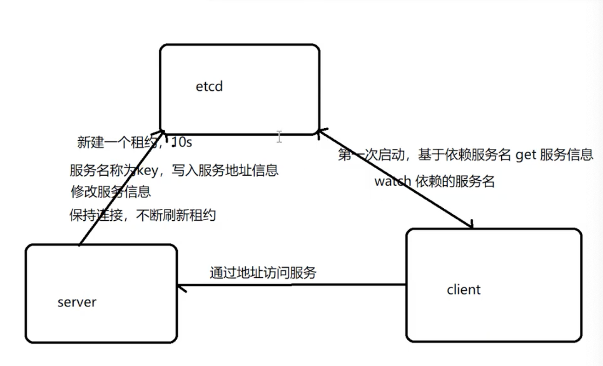

# ETCD 实现服务的注册与发现
## 服务注册和发现的基本实现流程
解决的问题：通过服务名称找到服务的地址。也就是以服务名称为 key ，服务地址信息为值，通过 key 找值。
### etcd 基本流程

#### 初步启动的步骤
- 服务器启动的时候将服务名称作为 key，写入服务地址信息到 etcd
- 客户端第一次启动的时候，基于依赖服务名 get 服务信息
- 客户端通过地址访问服务
#### 服务信息修改后的步骤(通过 watch 监听变化)
- 服务器修改服务信息
- 客户端通过 watch 监听依赖的服务名称，变动时客户端会感知到 获取到新的地址。
#### 如何防止服务器突然奔溃，没有删除 etcd 上的信息
- 服务端创建一个 租约 ，比如说是 10s 有效期
- 服务端保持连接，不断刷新租约


## 客户端缓存结合 etcd 实现服务发现
## etcd 结合grpc 名称解析实现注册发现

## 常见命令
### etcd 租约(lease)概念
类比 redis 每个 key 可以设置过期时间，redis 会监听每个 key 的过期时间。
在 etcd 中 每个 key 可以关联租约，对租约设置过期时间，如果租约过期了则关联的所有 key 都过期了。

- etcdctl lease grant 创建租约
- etcdctl keep-alive 保持租约存活
### watch
监听某些 key 的变化
- 可以使用 --prefix 监听某些字符串开头的 key
- 可以使用 --from 监听比某些 key 大的 key

etcdctl get "" --prefix 查看 key 和 value

etcdctl get echo-service1 -w json 查看 key 的详细信息
```json
{"header":{"cluster_id":14841639068965178418,"member_id":10276657743932975437,"revision":5,"raft_term":3},"kvs":[{"key":"ZWNoby1zZXJ2aWNlMQ==","create_revision":4,"mod_revision":5,"version":2,"value":"bG9jYWxob3N0OjUwMDUx","lease":7587891376478779151}],"count":1}
```
